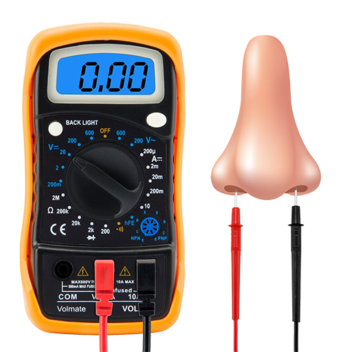
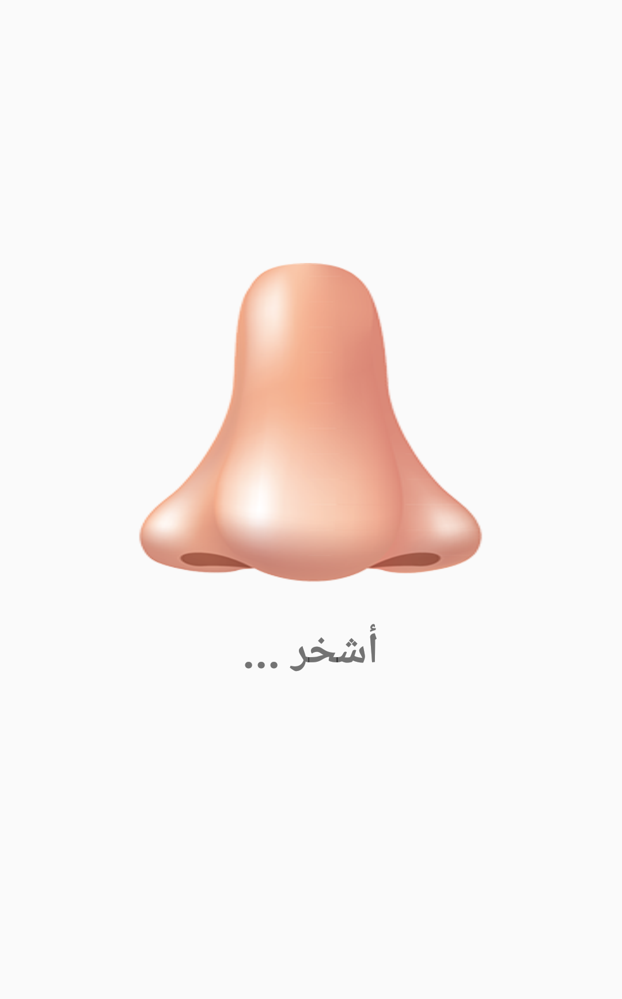
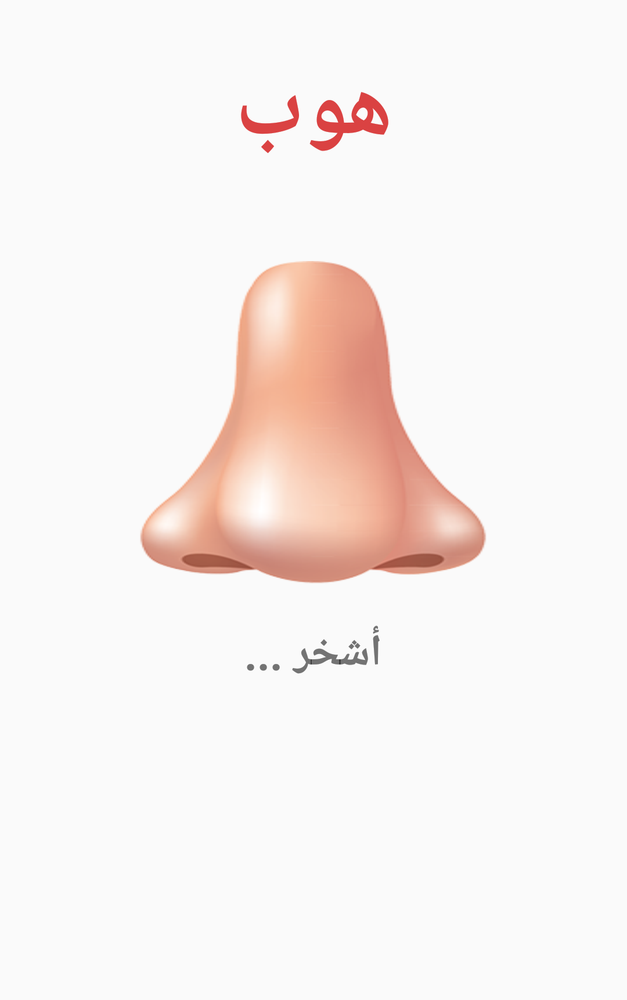
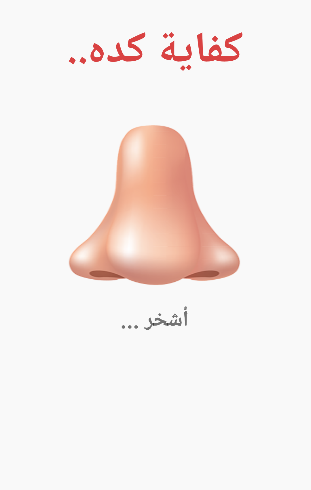
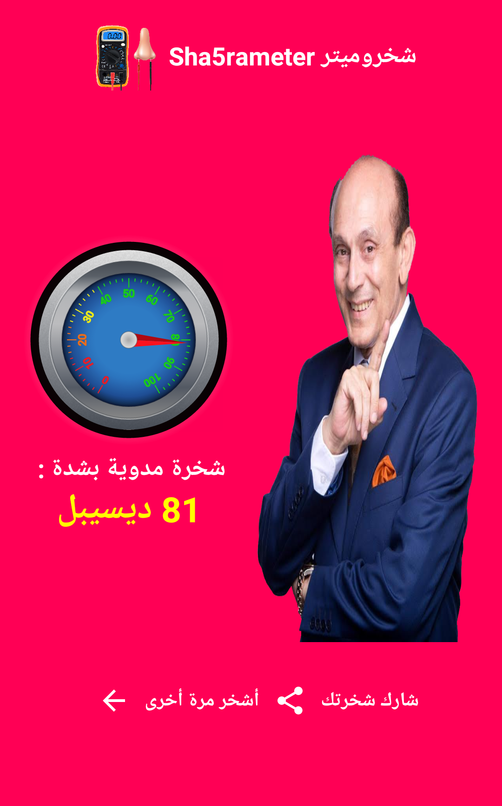

<div align="center" dir="rtl">
  <a href="https://play.google.com/store/apps/details?id=com.ma7moud3ly.sha5rameter" target="_blank">
    
  </a>

# [Sha5rometer شخروميتر](https://play.google.com/store/apps/details?id=com.ma7moud3ly.sha5rameter) 
```
شخروميتر : مقياس شدة الشخرة بالديسيبل
```

<br>
<div>
  
  
  
</div>
<br>
<div>
  
  
  
</div>
<br>
[Download From Google Play](https://play.google.com/store/apps/details?id=com.ma7moud3ly.sha5rameter) 
</div>
